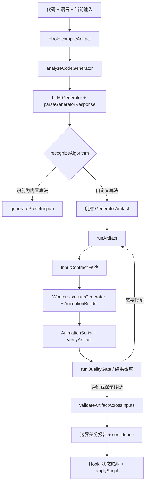
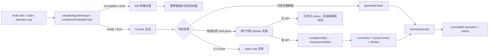
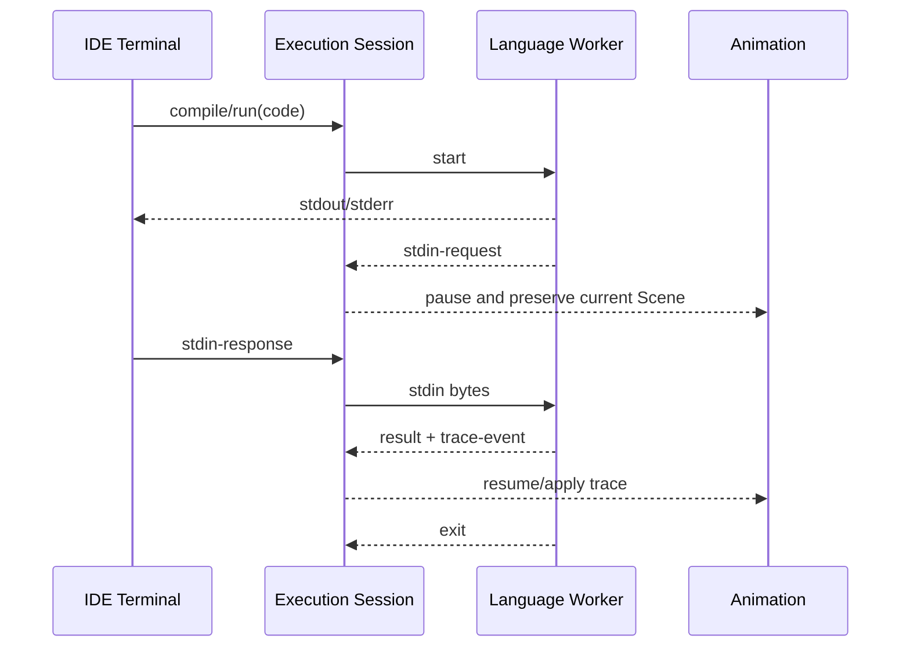
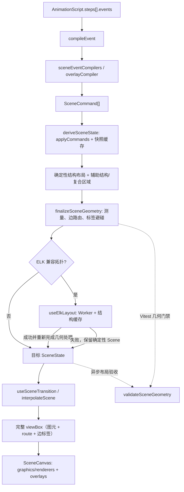

# AlgoViz 架构定义

> 状态：当前架构与目标架构的单一事实源
> 更新日期：2026-07-29
> 适用范围：浏览器端算法生成、可复用动画生成器、沙箱执行、Scene 布局/渲染和本地持久化

## 1. 目标与边界

AlgoViz 的核心不是保存某个输入对应的一段动画，而是把一份算法实现编译成可复用的动画生成器：

```text
算法源码 --LLM（首次）--> Reusable Generator
任意合法输入 --本地 Worker--> AnimationScript --Scene Engine--> 交互动画
```

必须满足：

1. 同一份算法源码只在首次分析或显式修复时调用 LLM。
2. 只改变输入值时，不调用 LLM；本地重新执行已保存的生成器。
3. 算法计算与动画采样分离。限制动画步数不能提前结束算法计算。
4. LLM 只生成受约束的适配器；结果、状态和不变量由确定性代码验证。
5. `AnimationScript` 是单次输入的临时产物，可复用 Generator 才是长期资产。
6. 不可信生成器只能在 Worker 中运行；Worker 不可用时失败关闭。
7. Scene Engine 不依赖 LLM、页面、Store 或网络实现。

当前阶段不做：

- 不重写已经稳定的 Scene Engine。
- 不为了目录“好看”批量搬迁全部模块。
- 不引入微前端、依赖注入容器或通用插件框架。
- 不承诺输入结构发生根本变化时继续复用旧 Generator；复用边界是“同一源码、同一输入契约、不同输入值”。

## 2. 当前系统地图

### 2.1 主要模块

| 目录 | 当前职责 | 允许依赖 | 不应依赖 |
|---|---|---|---|
| `src/pages`、`src/components` | 页面编排与交互 | hooks、store、公开领域 API | Worker 内部实现 |
| `src/hooks` | 页面共享编排：取消、防抖、React 状态和 UI 回调映射 | generator 应用服务、presets、store | Worker、Prompt、修复与验证内部 |
| `src/generator` | Artifact/InputContract、编译编排、统一运行/验证和边界验收 | ai、sandbox、presets、核心类型 | React、Store、Scene Renderer |
| `src/ai` | LLM 请求、Prompt、响应解析、修复、分类和质量规则 | AnimationScript/事件契约 | React 页面 |
| `src/sandbox` | Builder、Generator 执行、用户代码执行、Worker 与超时 | AnimationScript/事件契约 | React、Store、网络 |
| `src/presets` | 可信的本地可复用算法生成器 | Builder、AnimationScript | LLM 客户端 |
| `src/scene` | 事件编译、场景派生、确定性/ELK 布局、几何测量与路由、补间和渲染 | AnimationScript/事件契约、ELK Worker | AI、Store、页面 |
| `src/store` | 用户选择、当前脚本、AI 历史等客户端状态 | 数据与核心类型 | Scene 内部实现 |
| `src/data` | 算法目录、元数据与代码模板 | 核心类型 | 页面状态 |
| `server` | 同源 LLM 代理和生产静态服务 | HTTP/环境配置 | 前端状态 |

### 2.2 当前首次分析数据流

入口在 `src/hooks/useAIGenerator.ts`，非 React 主流程位于 `src/generator/compile.ts`。



关键事实：

- 模型输出的是可执行 Generator，不是固定 `AnimationScript`。
- 内置算法优先转入 `src/presets` 的可信本地生成器。
- 自定义 Generator 在 `generatorWorker.ts` 中执行，默认超时 5 秒。
- JS/Python 尽可能执行原代码获得真值；`@expect` 是降级依据，不是强信任根。
- 失败时 `fallbackScene` 生成合法但明确标记失败的动画，避免空白画布。

### 2.3 当前工作台编译会话

代码和输入都是会话输入；逐键编辑不再直接驱动动画。页面保存 Draft 与 Committed 两份输入/代码，只有显式“运行”或 `Ctrl+Enter` 才提交：



公共边界：

- `src/workbench/inputCompiler.ts` 统一输入结构扫描、类型/领域校验和 `E_INPUT_*` 源位置诊断；未闭合输入是 `incomplete`，不是错误也不会触发默认值回退。
- `src/workbench/runtimeContract.ts` 统一语言能力（JS/Python 为 Worker，C++/Java 为 static-only）、Map/Set/Infinity/BigInt 等 JSON-safe 输出和终端格式化。
- `src/components/Editor/WorkbenchTerminal.tsx` 只负责 IDE 式 stdin/arg/diagnostics/runtime/stdout 展示，不解析算法。
- `src/data/codeTemplates.ts` 的全部内置 Python/JavaScript 模板使用 `solve(inputData)` ABI；`src/sandbox/runUserCode.ts` 与 `runUserPython.ts` 优先调用 `solve`，并在 Worker 不可用时失败关闭。
- `AnimationScript.result` 是递归 JSON 值；二维矩阵、路径、棋盘、子集和编码表保持结构，不再压成说明字符串。
- 永久门禁对全部 75 个 preset 执行默认 JavaScript 模板并比较真实返回值与 `script.result`；输入响应门禁无豁免地验证输入变化会改变初始状态、结果或步骤。

InputContract 仍只表达已观察到的顶层类型、数组元素类型和对象字段类型；复杂嵌套约束稳定后再评估 JSON Schema/Ajv。Python 真值依赖 Python Worker/Pyodide 可用性；不可用时明确失败，不把 `@expect` 当作高可信差分。

### 2.4 严格进程式执行会话

长期目标是让代码而不是工作台表单决定是否读取输入、读取几次、输出什么以及何时推进动画。进程式程序启动后保持同一个 Language Worker；执行到读取语句才请求 stdin，提交后从原调用栈继续：



公共协议由 `src/workbench/executionProtocol.ts` 定义，包含 `compiling`、`running`、`stdout`、`stderr`、`stdin-request`、`stdin-response`、`result`、`trace-event`、`exit`、`error`、`cancel/timeout`。状态机固定为：

```text
idle → compiling → running
running → waiting-input → running
running → finished | error | cancelled
```

边界约束：

- `stdout`/`stderr` 只承载人类可读文本，`result` 承载结构化最终值，`trace-event` 承载动画事实，`diagnostics` 承载编译错误；禁止从 stdout 文本反推动画。
- 到达输入边界时暂停动画并保留当前 Scene；等待用户输入不计入 CPU 执行超时，提交后同一 Worker 继续，Reset、代码切换或算法切换会终止会话。
- 当前首条纵切支持 JavaScript `main()`、异步 `readLine()`、流式输出、结构化结果和 trace 收集；旧 `solve(inputData)` ABI 继续服务内置模板和已有生成器。
- C++/Java 不使用 Docker、宿主机编译器、远程执行或有限正则转译器。目标分别是随项目本地分发并在 Worker 中运行的 Clang/LLVM WASM + WASI，以及 javac + 浏览器 JVM；依赖选型和资源许可验收完成前继续明确报告 static-only。
- 生成器 Artifact 与输入契约继续持久化；同一份程序和生成器对新输入在浏览器本地重跑，不再次请求 LLM。

分阶段演进：

1. 公共协议与 JavaScript async `readLine()` 纵切。
2. Python `input()` 迁入同一会话协议。
3. 配置 COOP/COEP，以 SharedArrayBuffer + Atomics 建立共享 stdin 字节管道。
4. 接入本地 Clang/LLVM WASM + WASI。
5. 接入本地 javac + 浏览器 JVM。
6. 75 个模板从 `solve(inputData)` 迁移到可产生 trace 的进程式 ABI。
7. 全部语言完成后，旧 `solve` ABI 仅保留兼容用途。

### 2.5 Scene 数据流



契约边界：

- `AlgorithmEvent` 表达算法语义。
- `SceneCommand` 表达场景修改。
- `SceneState` 是某一步的完整目标快照。
- `SceneEdge.route` 和 `SceneEdge.labelPosition` 是布局阶段写入的持久化几何，Renderer 不再临时猜测连线。
- Renderer 只读取 `SceneState`，不解释算法源码，也不访问 LLM。
- 编译器顺序由 `src/scene/compilerRegistry.ts` 统一管理，先匹配先生效。
- `deriveSceneState` 可以缓存，但其输出必须只由脚本和步骤决定。
- `measureSceneGeometry` 统一测量可见节点与文本；`finalizeSceneGeometry` 负责确定性避障路由、箭头净空和边标签候选位置；`validateSceneGeometry` 在测试中拒绝图元/文本重叠、穿越非端点障碍的边、被目标节点遮挡的箭头和树中的孤立节点。
- ELK 按 Scene 拓扑为所有树、带边的图、并查集和跳表提供异步布局；数组、矩阵、DP、栈、队列等语义布局不进入 ELK。Worker 不可用或布局失败时保留已有确定性 Scene，不引入第二套 Renderer。
- 几何、自动机、概率等专用 Renderer 自己管理内部坐标，不伪装成通用 `SceneCell` 参与外层碰撞计算。

### 2.5 持久化

| localStorage key | 内容 | 当前问题 |
|---|---|---|
| `algoviz-api-config` | 模型服务配置和 API Key | 仅适合本地个人使用 |
| `algoviz-lang` | 语言 | 无 |
| `algoviz-ai-history` | 代码、输入、最近脚本和版本化 GeneratorArtifact | 旧 `generatorBody/generatorType` 记录在读取时迁移 |

## 3. 目标生成架构

### 3.1 两阶段模型

#### 编译阶段：允许调用 LLM

输入：

- 算法源码与语言。
- 用户当前输入（仅作为样例）。
- Builder 协议版本。
- Prompt 协议版本。

输出应是 `GeneratorArtifact`：

```ts
interface GeneratorArtifact {
  artifactVersion: 1
  sourceHash: string
  cacheKey: string
  language: string
  category: AlgorithmCategory
  algorithm: string
  rendererType: RendererType
  inputContract: InputContract
  generatorSource: string
  builderVersion: string
  promptVersion: string
  validation: GeneratorValidationReport
  expectedResult?: string
  timeComplexity?: string
  spaceComplexity?: string
}
```

Phase 1 的 `InputContract` 是不依赖第三方 Schema 库的最小可持久化协议：

```ts
interface InputContract {
  version: 1
  acceptedKinds: Array<'array' | 'object' | 'number' | 'string' | 'boolean' | 'null'>
  requiredObjectKeys: string[]
  arrayItemKind?: InputValueKind
  objectPropertyKinds?: Record<string, InputValueKind>
  source: 'inferred' | 'legacy'
}
```

运行时强制校验顶层类型和必需字段；元素/字段类型用于生成边界输入。对象字段只有在至少
两个独立样例中都出现时才标记为必需，避免从单个 `@sample` 误判可选字段。复杂嵌套约束
留到契约稳定后再评估 Ajv。

缓存键：

```text
sourceHash + language + builderVersion + promptVersion
```

缓存键不得包含输入值。

#### 运行阶段：禁止调用 LLM

```text
raw input
  → InputContract 校验与规范化
  → Worker 执行 generatorSource
  → 运行时/语义/结果验证
  → 步骤压缩
  → AnimationScript
```

失败时返回结构化错误和 fallback，不自动请求 LLM。只有用户重新分析或显式修复时才进入编译阶段。

### 3.2 Generator 运行契约

Generator 必须是纯输入驱动的可重复程序：

- 所有算法数据来自 `input`。
- 不读取 `@sample`、历史输入或 UI 状态。
- 不访问网络、DOM、时间和随机数。
- 不修改外部状态。
- 完整执行算法后调用 `b.result(realResult)`。
- 事件预算耗尽时只停止或合并教学事件，不能 `break`、截断输入或提前 `return`。
- 相同输入和同一协议版本产生等价脚本。

`@sample` 只用于发现输入契约和首次验证，`@expect` 只用于无法执行原代码时的低可信降级验证。

### 3.3 验证分层

| 层 | 负责内容 | 当前实现 | 目标补强 |
|---|---|---|---|
| 解析 | Generator 指令和源码可提取 | `generatorParser` | 保存协议版本 |
| 安全运行 | Worker、超时、结构化失败 | `runGeneratorSandboxed` | 保持失败关闭 |
| 结构 | Script、事件、下标合法 | `schema`、compiler 断言 | 输入契约 |
| 结果 | 动画结果等于原代码结果 | `verifyAndTag` | 多输入差分 |
| 语义质量 | 结构和教学事件充分 | `runQualityGate` | DP/回溯不变量 |
| 渲染 | 事件能派生稳定场景 | diagnostics、Scene 测试 | Generator 验收中加入场景重放 |

准确性至少包含四种不同问题，不能用一个“AI 评分”代替：

1. 计算正确性：最终结果是否正确。
2. 轨迹真实性：中间值、依赖、选择和撤销是否来自真实执行。
3. 教学正确性：是否表达了状态定义、决策依据和关键阶段。
4. 渲染兼容性：事件是否能稳定编译和显示。

### 3.4 高层语义 API

LLM 不应手工拼接多个可能互相矛盾的低层事件。后续优先在 Builder 增加少量高层操作，并由 Builder 展开成现有事件。

DP 示例：

```ts
b.dpDecide({
  target,
  dependencies,
  candidates,
  operator: 'min' | 'max' | 'sum' | 'or',
  chosen,
  value,
})
```

回溯示例：

```ts
b.backtrackTry({ depth, choice, valid, reason })
b.backtrackCommit({ choice })
b.backtrackUndo({ choice, reason })
b.backtrackSolution({ path })
```

这样可以确定性保证高亮、依赖、公式、写值、树节点、调用栈和说明指向同一次决策，并继续复用现有 Scene 事件与 Renderer。

### 3.5 长步骤压缩

计算层与记录层必须分开：

```text
Algorithm State（始终完整计算）
        ↓
Teaching Recorder（按策略记录）
        ↓
Step Compactor（按预算合并）
```

确定性策略：

- 小输入：保留全部关键决策。
- 中输入：保留代表性状态、边界、改进、剪枝、回溯和答案。
- 大输入：保留阶段里程碑，并统计省略的同类步骤。
- 初始化、首次典型决策、第一次冲突、第一次完整回溯、最优值变化和最终答案不可被丢弃。

## 4. 依赖方向

目标依赖只能向下：

```text
pages/components
      ↓
feature orchestration
      ↓
ai compile service ──→ generator domain ←── presets
      ↓                      ↓
LLM transport          sandbox workers
                             ↓
                    AnimationScript/events
                             ↓
                        Scene Engine
                             ↓
                          renderers
```

硬规则：

- `scene` 不得导入 `ai`、`store`、`pages`。
- `sandbox` 不得导入 React、Store 或网络客户端。
- `ai` 不得直接操作 Scene Renderer；只能产生/验证契约对象。
- `presets` 与 AI Generator 使用同一 Builder 和语义验证器。
- 页面只调用应用服务或 Hook，不拼装 Prompt、Worker 消息和修复规则。
- 跨领域导入优先走公开 `index.ts`；领域内部使用相对导入。

其中 Scene、Sandbox 和 AI 的关键禁止依赖已通过 `eslint.config.js` 的
`no-restricted-imports` 固化；新增跨层导入会在 `npm run lint` 中直接失败。

## 5. 目录落位

Phase 4 完成后的实际职责结构如下。保持现有短文件，不为目录外观拆出单实现接口或空目录：

```text
src/
├─ ai/                         # 仅 LLM 编译期
│  ├─ prompt/
│  ├─ quality/
│  ├─ client.ts
│  ├─ generatorParser.ts
│  └─ repairGenerator.ts
├─ generator/                  # 可复用 Generator 领域
│  ├─ contracts.ts             # Artifact、InputContract、边界输入
│  ├─ compile.ts               # 非 React 编译/修复应用服务
│  ├─ runtime.ts               # runArtifact、差分验证、confidence
│  └─ index.ts
├─ sandbox/                    # Builder、Worker 边界与用户代码执行
│  ├─ builder.ts
│  ├─ executeGenerator.ts
│  ├─ generatorWorker.ts
│  ├─ interactiveJavaScriptWorker.ts
│  ├─ runInteractiveJavaScript.ts
│  └─ runGenerator.ts
├─ workbench/                  # IDE 编译会话的纯领域服务
│  ├─ executionProtocol.ts     # 进程状态机与 stdin/stdout/trace 协议
│  ├─ inputCompiler.ts         # 输入状态机与 E_INPUT_* 诊断
│  └─ runtimeContract.ts       # 语言能力、JSON-safe 输出与 stdout 格式
├─ presets/                    # 可信本地 Generator
├─ scene/
│  ├─ graphics/
│  │  ├─ builders/
│  │  ├─ compile/
│  │  ├─ renderers/
│  │  └─ shared/
│  ├─ layouts/
│  ├─ overlays/
│  ├─ primitives/
│  └─ engine files
├─ hooks/
│  └─ useAIGenerator.ts        # 薄 React 编排
├─ pages/
├─ components/
├─ data/
└─ store/
```

如果 `contracts.ts`、`compile.ts` 或 `runtime.ts` 将来因独立职责继续增长，再按真实边界拆目录；
当前三文件结构已覆盖编译、运行和契约，不增加转发层。

## 6. 开源方案评估

调研日期为 2026-07-28。结论是借鉴架构，不直接替换现有核心。

| 项目 | 可借鉴点 | 不直接采用的原因 | 决策 |
|---|---|---|---|
| [Algorithm Visualizer](https://github.com/algorithm-visualizer/algorithm-visualizer) / [tracers.js](https://github.com/algorithm-visualizer/tracers.js) | 算法代码调用 Tracer；Web UI 解释命令；`Tracer.delay()` 划分教学步骤。与“可复用 Generator → 命令 → Renderer”高度一致 | Tracer API 和布局体系与现有 Scene 协议不同，替换会丢失当前 Builder、事件、补间和测试资产 | 借鉴执行/记录分离和显式步骤边界 |
| [JSAV / OpenDSA](https://github.com/OpenDSA/JSAV) | 教学型数据结构、可扩展视图、逐步播放；MIT | 技术栈和 API 较旧，直接嵌入 React/TypeScript 会增加双渲染体系 | 借鉴教学状态与数据结构抽象 |
| [Manim Community](https://github.com/ManimCommunity/manim) | 高质量解释型动画和分镜思想；MIT | Python 离线视频渲染，不适合浏览器交互、输入即时重算和 Worker 沙箱 | 仅作为分镜与动效参考 |
| [Cytoscape.js](https://github.com/cytoscape/cytoscape.js) | 大图数据模型、布局、缩放和平移性能 | 只覆盖图/网络；AlgoViz 还要数组、DP、栈、字符串、变量和复合场景 | 暂不引入；超大搜索树成为瓶颈时单独评估 |
| [XState](https://github.com/statelyai/xstate) | 显式异步状态、guard、actor、持久化快照，适合复杂工作流 | 当前主要问题是职责集中而非状态机能力缺失；现在加入会增加概念和包体 | 先抽纯服务；状态转换继续失控时再采用 |
| [Ajv](https://github.com/ajv-validator/ajv) | 浏览器可用的 JSON Schema 编译验证器，适合持久化 `InputContract` | 当前尚未稳定输入契约格式；立即加入会固化未成熟 Schema | InputContract 定稿后优先候选 |
| [Knip](https://knip.dev) | 从入口图检查未使用文件、依赖和未声明依赖 | 导出级报告对公共 API 和测试辅助函数会有噪声 | Phase 1 已作为开发依赖接入；当前门禁只检查高置信度的文件和依赖问题 |
| [Eclipse ELK / elkjs](https://github.com/kieler/elkjs) | 分层布局、正交边路由和浏览器 Worker 支持 | 全量替换会形成第二套布局/渲染协议，且数组、DP、栈等结构并不受益 | 已以 `elkjs@^0.12.0` 覆盖所有兼容拓扑；懒加载 Worker，失败回退确定性 Scene |

采用原则：

1. 新依赖必须替换现有复杂代码或提供当前无法可靠实现的能力。
2. 只解决单一视图的问题，不得侵入通用 Scene 协议。
3. 开源许可证、浏览器支持、维护状态和包体必须记录。
4. 框架不能成为 LLM 输出正确性的信任来源。

## 7. 分阶段演进

### Phase 0：架构基线与无行为目录整理

- 本文成为架构单一事实源。
- README 只保留概览并链接本文。
- 编译器测试与 Renderer 测试迁到实现旁。
- 共享几何投影工具移入 `scene/graphics/shared`。
- 不改变运行时行为和依赖。

验收：Scene 定向测试、全量 lint、coverage、build 通过。

### Phase 1：Generator Artifact 与输入契约

- [x] 定义 `GeneratorArtifact`、`InputContract` 和 Builder/Prompt 协议版本。
- [x] 缓存键改为源码/语言/协议版本，不包含输入值。
- [x] 历史记录引用 Artifact；`AnimationScript` 仍作为最近一次结果缓存。
- [x] 旧 `generatorBody/generatorType` 历史在读取时兼容迁移为 Artifact。
- [x] 输入变化路径先校验 InputContract，再直接执行 Worker，零 LLM 请求。
- [x] Knip 高置信度基线接入；11 个已有未引用文件在 `knip.json` 中显式登记，留待后续删除/归并阶段处理。

验收：同一 Artifact 在至少 5 个不同输入上本地运行；源码不变时 LLM mock 调用次数保持不变。

实现位置：`src/generator/contracts.ts`。验收覆盖真实本地 Generator 执行五组输入、
Hook 五次换输入且 LLM mock 为零、历史持久化和旧格式迁移。

### Phase 2：抽取生成应用服务

- [x] 从 `useAIGenerator` 抽出非 React 的 compile/run/verify 服务。
- [x] Hook 只负责取消、debounce、状态映射和 UI 回调。
- [x] 初始生成、修复重跑、边界验收与输入重跑共享同一个 `runArtifact`。

验收：首次与换输入使用同一执行/验证路径；Hook 测试不需要理解 Worker 内部。

实现位置：`src/generator/compile.ts`、`src/generator/runtime.ts`、
`src/hooks/useAIGenerator.ts`。Hook 测试只 mock 应用服务；编译服务单测断言首次执行进入
`runArtifact`。

### Phase 3：高层语义 API 与不变量

- [x] 加入 `dpDecide` 和 `backtrackTry/Commit/Undo/Solution`。
- [x] 验证 DP 下标、依赖先后、候选运算和值一致性。
- [x] 验证搜索栈平衡、父子关系、commit/undo 状态恢复。
- [x] 删除 Prompt 中允许为动画 `break/限制规模` 的规则。

验收：构造错误的 DP 值、错误依赖、漏撤销都被确定性拒绝。

实现位置：`src/sandbox/builder.ts`、`src/ai/prompt/core.ts` 及 DP/recursion 类别 Prompt；
`builderSemantics.test.ts` 覆盖正确展开和所有拒绝路径。

### Phase 4：多输入验收与步骤压缩

- [x] 按 InputContract 生成小型边界测试集，并允许调用方补充领域用例。
- [x] JS/Python 与真实代码做差分；其他语言标记为 `unverified`。
- [x] Builder 控制可配置事件预算，算法计算不受影响。
- [x] 在 Artifact 保存逐用例验证报告与 `high/medium/low/unverified` 可信度。

验收：空、最小、重复、无解、平局等输入通过；大输入结果不因动画预算改变。

实现位置：`src/generator/contracts.ts`、`src/generator/runtime.ts`、
`src/sandbox/builder.ts`、`src/sandbox/executeGenerator.ts`。运行时测试覆盖 JS 真值通过/失败、
其他语言未验证、五类显式边界输入，以及不同事件预算下结果一致。

### Phase 5：Scene 几何契约与 ELK 兼容拓扑布局

- [x] 跳表改用专用 `skip_list` 模块和真实逐层搜索事件：创建、比较、右移、下沉、命中/未命中。
- [x] 跳表确定性布局按文本宽度计算列宽，避免 `initialState` 重复种入数组。
- [x] 增加共享几何测量、确定性避障路由和边标签候选位置；路由与标签位置写入 `SceneEdge`。
- [x] 补间层插值边路由与标签位置，viewBox 纳入完整路由和边标签范围。
- [x] 以 Worker + 结构缓存接入 ELK，按 Scene 拓扑覆盖所有树、带边的图、并查集和跳表；失败保留确定性布局。
- [x] `graph.create.directed` 贯穿编译，避免有向图在布局选择前丢失方向语义。
- [x] 全部内置预设逐步骤执行重叠、穿线、箭头净空和树节点连通门禁；跳表在桌面与紧凑视口执行 Playwright 截图回归。
- [x] 二叉树按 LeetCode 队列式层序输入建树，保留 `null` 和重复值，并从真实拓扑计算遍历轨迹与 BFS 结果；B+ 树搜索/范围查询返回用户可见结果。

实现位置：`src/scene/geometry.ts`、`src/scene/layouts/elkLayout.ts`、
`src/scene/layouts/useElkLayout.ts`、`src/scene/graphics/compile/skipListCompile.ts`。
几何门禁覆盖图元/文本重叠、边穿越非端点障碍、箭头遮挡和树孤立节点；专用 Renderer 的内部几何继续由各自测试负责。

### Phase 6：IDE 编译会话与全算法结果契约

- [x] Draft/Committed 输入和代码分离；编辑期间暂停并冻结旧动画，显式运行后才提交。
- [x] IDE 式终端统一 stdin、操作参数、编译诊断、运行状态和 stdout。
- [x] 输入编译器统一未完成、语法、类型与领域错误；覆盖图引用/负权、数独冲突、网格端点、窗口范围和结构专用约束。
- [x] `AnimationResult` 扩展为递归 JSON 值，矩阵、路径、棋盘、子集、SCC 和编码表保留结构。
- [x] 全部内置 Python/JavaScript 模板提供 `solve(inputData)`；C++/Java 明确为 static-only。
- [x] 全部 75 个 JavaScript 模板真实执行结果与 preset 结果一致；全部 75 个 preset 通过无豁免输入响应门禁。
- [x] 水塘抽样使用显式 seed 的确定性 RNG，动画和代码可复现。

实现位置：`src/workbench/inputCompiler.ts`、`src/workbench/runtimeContract.ts`、
`src/components/Editor/WorkbenchTerminal.tsx`、`src/data/codeTemplates.ts`、
`src/sandbox/runUserCode.ts`、`src/sandbox/runUserPython.ts`。

### Phase 7：严格交互式语言会话

- [x] 定义统一执行事件、请求协议和 `idle → compiling → running → waiting-input` 状态机。
- [x] JavaScript `main()` 在独立 Worker 中支持异步 `readLine()`、流式 stdout/stderr、结构化 result、trace 收集、取消与分段 CPU 超时。
- [x] IDE 终端仅在程序请求输入时激活单行 `stdin>`，并将 stdout、stderr、result 分开显示。
- [ ] 将 trace 事件编译并增量提交给动画引擎。
- [ ] Python 迁移到严格交互协议，并完成共享 stdin 字节管道与 COOP/COEP。
- [ ] 完成 C++ Clang/WASI 与 Java javac/JVM 的本地资源、Worker 运行、缓存、许可和端到端验收。
- [ ] 逐步迁移 75 个模板；迁移完成前保留 `solve(inputData)` 兼容层。

实现位置：`src/workbench/executionProtocol.ts`、
`src/sandbox/interactiveJavaScriptWorker.ts`、`src/sandbox/runInteractiveJavaScript.ts`、
`src/components/Editor/WorkbenchTerminal.tsx`、`src/pages/Visualizer/index.tsx`。

## 8. 架构决策记录

### ADR-001：保留 Scene Engine

原因：当前事件编译、快照、补间、布局和 Renderer 已有完整测试资产；外部框架无法同时覆盖全部数据结构。

### ADR-002：Generator 是长期资产，AnimationScript 是运行结果

原因：只有可执行 Generator 才能在不同输入下零 LLM 调用地产生正确动画。

### ADR-003：真实执行和确定性验证高于 LLM 自证

原因：`@expect` 与动画来自同一个模型，不能构成独立证据。

### ADR-004：计算与动画采样分离

原因：用 `break` 控制步骤会改变算法语义。预算只能作用于 Recorder。

### ADR-005：渐进式目录迁移

原因：大规模路径移动只改善表面结构，却放大冲突和回归风险。文件只在职责被实际抽取时迁移。

### ADR-006：ELK 只增强布局，不替换 Scene

原因：ELK 擅长结构布局和边路由，但不是算法动画 Renderer。按 Scene 拓扑启用、Worker 隔离和确定性回退可以复用其能力，同时保持事件、补间、图元和测试体系只有一套。

## 9. 变更检查表

修改生成管线时必须回答：

- 是否只改变输入值就触发了 LLM？
- 是否把样例值或 `@expect` 写进运行逻辑？
- 是否完整执行算法后才产生结果？
- 动画预算是否可能改变算法控制流？
- 初次生成和输入重跑是否走同一验证路径？
- Worker 失败是否仍然失败关闭？
- 新事件是否有 Schema、编译、场景派生和 Renderer 验证？
- 是否在至少一个非样例输入上验证？
- 新布局是否保留事件语义（特别是有向边）并在 Worker 失败时保持可用？
- 新图元是否进入几何测量，或明确由专用 Renderer 管理内部几何？
- 新预设是否逐步骤通过重叠、穿线、箭头净空和树节点连通门禁，并在必要视口补充截图回归？

修改目录时必须回答：

- 文件职责是否真的改变或原归属是否明确错误？
- 移动后是否减少跨域导入或删除错误目录？
- 是否需要兼容 re-export；如果只为避免改导入，优先不移动。
- README、本文和测试路径是否同步？
