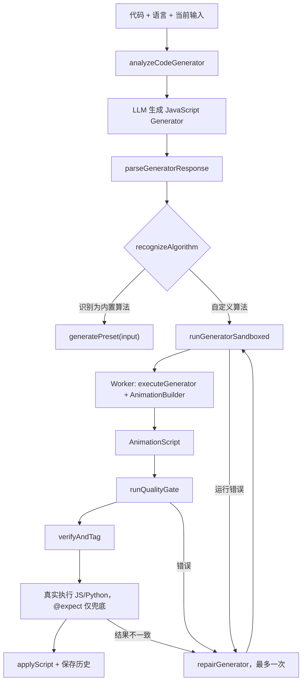
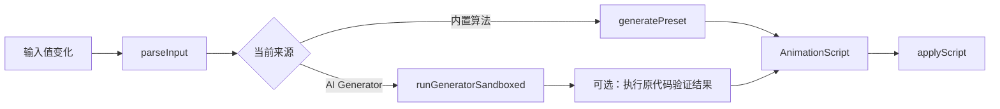
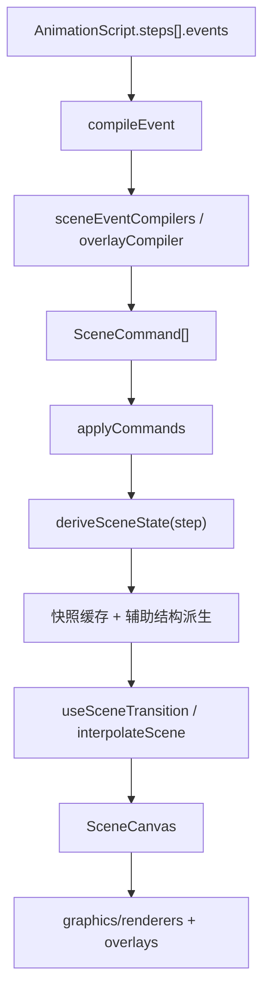

# AlgoViz 架构定义

> 状态：当前架构与目标架构的单一事实源
> 更新日期：2026-07-28
> 适用范围：浏览器端算法生成、可复用动画生成器、沙箱执行、Scene 渲染和本地持久化

## 1. 目标与边界

AlgoViz 的核心不是保存某个输入对应的一段动画，而是把一份算法实现编译成可复用的动画生成器：

```text
算法源码 --LLM（首次）--> Reusable Generator
任意合法输入 --本地 Worker--> AnimationScript --Scene Engine--> 交互动画
```

必须满足：

1. 同一份算法源码只在首次分析或显式修复时调用 LLM。
2. 只改变输入值时，不调用 LLM；本地重新执行已保存的生成器。
3. 算法计算与动画采样分离。限制动画步数不能提前结束算法计算。
4. LLM 只生成受约束的适配器；结果、状态和不变量由确定性代码验证。
5. `AnimationScript` 是单次输入的临时产物，可复用 Generator 才是长期资产。
6. 不可信生成器只能在 Worker 中运行；Worker 不可用时失败关闭。
7. Scene Engine 不依赖 LLM、页面、Store 或网络实现。

当前阶段不做：

- 不重写已经稳定的 Scene Engine。
- 不为了目录“好看”批量搬迁全部模块。
- 不引入微前端、依赖注入容器或通用插件框架。
- 不承诺输入结构发生根本变化时继续复用旧 Generator；复用边界是“同一源码、同一输入契约、不同输入值”。

## 2. 当前系统地图

### 2.1 主要模块

| 目录 | 当前职责 | 允许依赖 | 不应依赖 |
|---|---|---|---|
| `src/pages`、`src/components` | 页面编排与交互 | hooks、store、公开领域 API | Worker 内部实现 |
| `src/hooks` | 页面共享编排；当前包含 AI 生成主流程 | ai、sandbox、presets、store | Scene 渲染细节 |
| `src/ai` | LLM 请求、Prompt、响应解析、修复、分类和质量规则 | AnimationScript/事件契约 | React 页面 |
| `src/sandbox` | Builder、Generator 执行、用户代码执行、Worker 与超时 | AnimationScript/事件契约 | React、Store、网络 |
| `src/presets` | 可信的本地可复用算法生成器 | Builder、AnimationScript | LLM 客户端 |
| `src/scene` | 事件编译、场景派生、布局、补间和渲染 | AnimationScript/事件契约 | AI、Store、页面 |
| `src/store` | 用户选择、当前脚本、AI 历史等客户端状态 | 数据与核心类型 | Scene 内部实现 |
| `src/data` | 算法目录、元数据与代码模板 | 核心类型 | 页面状态 |
| `server` | 同源 LLM 代理和生产静态服务 | HTTP/环境配置 | 前端状态 |

### 2.2 当前首次分析数据流

入口在 `src/hooks/useAIGenerator.ts`。



关键事实：

- 模型输出的是可执行 Generator，不是固定 `AnimationScript`。
- 内置算法优先转入 `src/presets` 的可信本地生成器。
- 自定义 Generator 在 `generatorWorker.ts` 中执行，默认超时 5 秒。
- JS/Python 尽可能执行原代码获得真值；`@expect` 是降级依据，不是强信任根。
- 失败时 `fallbackScene` 生成合法但明确标记失败的动画，避免空白画布。

### 2.3 当前输入变化数据流

当前项目已经实现“换输入不调用 LLM”。`useAIGenerator` 保存 `liveAlgoId` 或 Generator body，输入变化经过 400ms 防抖后本地重跑：



此路径的现有限制：

- Generator 主要存在 React Hook 状态和历史记录中，没有独立、带版本的领域模型。
- 首次验收主要针对一个输入，尚无系统化多输入差分测试。
- 输入契约未持久化，合法输入范围依赖 Prompt 和运行时报错。
- 质量门检查“是否有结构和操作”，还不能完整验证 DP 决策和回溯撤销。
- Generator 生成、修复、执行、验证和 UI 状态集中在一个 Hook 中，职责过重。

### 2.4 Scene 数据流



契约边界：

- `AlgorithmEvent` 表达算法语义。
- `SceneCommand` 表达场景修改。
- `SceneState` 是某一步的完整目标快照。
- Renderer 只读取 `SceneState`，不解释算法源码，也不访问 LLM。
- 编译器顺序由 `src/scene/compilerRegistry.ts` 统一管理，先匹配先生效。
- `deriveSceneState` 可以缓存，但其输出必须只由脚本和步骤决定。

### 2.5 持久化

| localStorage key | 内容 | 当前问题 |
|---|---|---|
| `algoviz-api-config` | 模型服务配置和 API Key | 仅适合本地个人使用 |
| `algoviz-lang` | 语言 | 无 |
| `algoviz-ai-history` | 代码、输入、脚本、Generator body | 尚未形成版本化 Generator Artifact |

## 3. 目标生成架构

### 3.1 两阶段模型

#### 编译阶段：允许调用 LLM

输入：

- 算法源码与语言。
- 用户当前输入（仅作为样例）。
- Builder 协议版本。
- Prompt 协议版本。

输出应是 `GeneratorArtifact`：

```ts
interface GeneratorArtifact {
  artifactVersion: 1
  sourceHash: string
  cacheKey: string
  language: string
  category: AlgorithmCategory
  algorithm: string
  rendererType: RendererType
  inputContract: InputContract
  generatorSource: string
  builderVersion: string
  promptVersion: string
  validation: GeneratorValidationReport
  expectedResult?: string
  timeComplexity?: string
  spaceComplexity?: string
}
```

Phase 1 的 `InputContract` 是不依赖第三方 Schema 库的最小可持久化协议：

```ts
interface InputContract {
  version: 1
  acceptedKinds: Array<'array' | 'object' | 'number' | 'string' | 'boolean' | 'null'>
  requiredObjectKeys: string[]
  source: 'inferred' | 'legacy'
}
```

当前只校验顶层输入类型；对象字段只有在至少两个独立样例中都出现时才标记为必需，
避免从单个 `@sample` 误判可选字段。复杂嵌套约束留到契约稳定后再用 Ajv 表达。

缓存键：

```text
sourceHash + language + builderVersion + promptVersion
```

缓存键不得包含输入值。

#### 运行阶段：禁止调用 LLM

```text
raw input
  → InputContract 校验与规范化
  → Worker 执行 generatorSource
  → 运行时/语义/结果验证
  → 步骤压缩
  → AnimationScript
```

失败时返回结构化错误和 fallback，不自动请求 LLM。只有用户重新分析或显式修复时才进入编译阶段。

### 3.2 Generator 运行契约

Generator 必须是纯输入驱动的可重复程序：

- 所有算法数据来自 `input`。
- 不读取 `@sample`、历史输入或 UI 状态。
- 不访问网络、DOM、时间和随机数。
- 不修改外部状态。
- 完整执行算法后调用 `b.result(realResult)`。
- 事件预算耗尽时只停止或合并教学事件，不能 `break`、截断输入或提前 `return`。
- 相同输入和同一协议版本产生等价脚本。

`@sample` 只用于发现输入契约和首次验证，`@expect` 只用于无法执行原代码时的低可信降级验证。

### 3.3 验证分层

| 层 | 负责内容 | 当前实现 | 目标补强 |
|---|---|---|---|
| 解析 | Generator 指令和源码可提取 | `generatorParser` | 保存协议版本 |
| 安全运行 | Worker、超时、结构化失败 | `runGeneratorSandboxed` | 保持失败关闭 |
| 结构 | Script、事件、下标合法 | `schema`、compiler 断言 | 输入契约 |
| 结果 | 动画结果等于原代码结果 | `verifyAndTag` | 多输入差分 |
| 语义质量 | 结构和教学事件充分 | `runQualityGate` | DP/回溯不变量 |
| 渲染 | 事件能派生稳定场景 | diagnostics、Scene 测试 | Generator 验收中加入场景重放 |

准确性至少包含四种不同问题，不能用一个“AI 评分”代替：

1. 计算正确性：最终结果是否正确。
2. 轨迹真实性：中间值、依赖、选择和撤销是否来自真实执行。
3. 教学正确性：是否表达了状态定义、决策依据和关键阶段。
4. 渲染兼容性：事件是否能稳定编译和显示。

### 3.4 高层语义 API

LLM 不应手工拼接多个可能互相矛盾的低层事件。后续优先在 Builder 增加少量高层操作，并由 Builder 展开成现有事件。

DP 示例：

```ts
b.dpDecide({
  target,
  dependencies,
  candidates,
  operator: 'min' | 'max' | 'sum' | 'or',
  chosen,
  value,
})
```

回溯示例：

```ts
b.backtrackTry({ depth, choice, valid, reason })
b.backtrackCommit({ choice })
b.backtrackUndo({ choice, reason })
b.backtrackSolution({ path })
```

这样可以确定性保证高亮、依赖、公式、写值、树节点、调用栈和说明指向同一次决策，并继续复用现有 Scene 事件与 Renderer。

### 3.5 长步骤压缩

计算层与记录层必须分开：

```text
Algorithm State（始终完整计算）
        ↓
Teaching Recorder（按策略记录）
        ↓
Step Compactor（按预算合并）
```

确定性策略：

- 小输入：保留全部关键决策。
- 中输入：保留代表性状态、边界、改进、剪枝、回溯和答案。
- 大输入：保留阶段里程碑，并统计省略的同类步骤。
- 初始化、首次典型决策、第一次冲突、第一次完整回溯、最优值变化和最终答案不可被丢弃。

## 4. 依赖方向

目标依赖只能向下：

```text
pages/components
      ↓
feature orchestration
      ↓
ai compile service ──→ generator domain ←── presets
      ↓                      ↓
LLM transport          sandbox workers
                             ↓
                    AnimationScript/events
                             ↓
                        Scene Engine
                             ↓
                          renderers
```

硬规则：

- `scene` 不得导入 `ai`、`store`、`pages`。
- `sandbox` 不得导入 React、Store 或网络客户端。
- `ai` 不得直接操作 Scene Renderer；只能产生/验证契约对象。
- `presets` 与 AI Generator 使用同一 Builder 和语义验证器。
- 页面只调用应用服务或 Hook，不拼装 Prompt、Worker 消息和修复规则。
- 跨领域导入优先走公开 `index.ts`；领域内部使用相对导入。

其中 Scene、Sandbox 和 AI 的关键禁止依赖已通过 `eslint.config.js` 的
`no-restricted-imports` 固化；新增跨层导入会在 `npm run lint` 中直接失败。

## 5. 目标目录

不一次性迁移。每个阶段在职责真正拆分时移动对应文件。

```text
src/
├─ ai/                         # 仅 LLM 编译期
│  ├─ client/
│  ├─ prompt/
│  ├─ parser/
│  └─ repair/
├─ generator/                  # 可复用 Generator 领域
│  ├─ contracts/
│  ├─ builder/
│  ├─ validation/
│  ├─ runtime/
│  └─ index.ts
├─ sandbox/                    # Worker 边界与用户代码执行
│  └─ workers/
├─ presets/                    # 可信本地 Generator
├─ scene/
│  ├─ graphics/
│  │  ├─ builders/
│  │  ├─ compile/
│  │  ├─ renderers/
│  │  └─ shared/
│  ├─ layouts/
│  ├─ overlays/
│  ├─ primitives/
│  └─ engine files
├─ features/
│  └─ animation-generation/    # 薄 UI 编排与 Hook
├─ pages/
├─ components/
├─ data/
└─ store/
```

`generator` 的抽取应先发生，之后再把 `useAIGenerator` 中的非 React 逻辑移入应用服务。避免先创建空目录和单实现接口。

## 6. 开源方案评估

调研日期为 2026-07-28。结论是借鉴架构，不直接替换现有核心。

| 项目 | 可借鉴点 | 不直接采用的原因 | 决策 |
|---|---|---|---|
| [Algorithm Visualizer](https://github.com/algorithm-visualizer/algorithm-visualizer) / [tracers.js](https://github.com/algorithm-visualizer/tracers.js) | 算法代码调用 Tracer；Web UI 解释命令；`Tracer.delay()` 划分教学步骤。与“可复用 Generator → 命令 → Renderer”高度一致 | Tracer API 和布局体系与现有 Scene 协议不同，替换会丢失当前 Builder、事件、补间和测试资产 | 借鉴执行/记录分离和显式步骤边界 |
| [JSAV / OpenDSA](https://github.com/OpenDSA/JSAV) | 教学型数据结构、可扩展视图、逐步播放；MIT | 技术栈和 API 较旧，直接嵌入 React/TypeScript 会增加双渲染体系 | 借鉴教学状态与数据结构抽象 |
| [Manim Community](https://github.com/ManimCommunity/manim) | 高质量解释型动画和分镜思想；MIT | Python 离线视频渲染，不适合浏览器交互、输入即时重算和 Worker 沙箱 | 仅作为分镜与动效参考 |
| [Cytoscape.js](https://github.com/cytoscape/cytoscape.js) | 大图数据模型、布局、缩放和平移性能 | 只覆盖图/网络；AlgoViz 还要数组、DP、栈、字符串、变量和复合场景 | 暂不引入；超大搜索树成为瓶颈时单独评估 |
| [XState](https://github.com/statelyai/xstate) | 显式异步状态、guard、actor、持久化快照，适合复杂工作流 | 当前主要问题是职责集中而非状态机能力缺失；现在加入会增加概念和包体 | 先抽纯服务；状态转换继续失控时再采用 |
| [Ajv](https://github.com/ajv-validator/ajv) | 浏览器可用的 JSON Schema 编译验证器，适合持久化 `InputContract` | 当前尚未稳定输入契约格式；立即加入会固化未成熟 Schema | InputContract 定稿后优先候选 |
| [Knip](https://knip.dev) | 从入口图检查未使用文件、依赖和未声明依赖 | 导出级报告对公共 API 和测试辅助函数会有噪声 | Phase 1 已作为开发依赖接入；当前门禁只检查高置信度的文件和依赖问题 |

采用原则：

1. 新依赖必须替换现有复杂代码或提供当前无法可靠实现的能力。
2. 只解决单一视图的问题，不得侵入通用 Scene 协议。
3. 开源许可证、浏览器支持、维护状态和包体必须记录。
4. 框架不能成为 LLM 输出正确性的信任来源。

## 7. 分阶段演进

### Phase 0：架构基线与无行为目录整理

- 本文成为架构单一事实源。
- README 只保留概览并链接本文。
- 编译器测试与 Renderer 测试迁到实现旁。
- 共享几何投影工具移入 `scene/graphics/shared`。
- 不改变运行时行为和依赖。

验收：Scene 定向测试、全量 lint、coverage、build 通过。

### Phase 1：Generator Artifact 与输入契约

- [x] 定义 `GeneratorArtifact`、`InputContract` 和 Builder/Prompt 协议版本。
- [x] 缓存键改为源码/语言/协议版本，不包含输入值。
- [x] 历史记录引用 Artifact；`AnimationScript` 仍作为最近一次结果缓存。
- [x] 旧 `generatorBody/generatorType` 历史在读取时兼容迁移为 Artifact。
- [x] 输入变化路径先校验 InputContract，再直接执行 Worker，零 LLM 请求。
- [x] Knip 高置信度基线接入；11 个已有未引用文件在 `knip.json` 中显式登记，留待后续删除/归并阶段处理。

验收：同一 Artifact 在至少 5 个不同输入上本地运行；源码不变时 LLM mock 调用次数保持不变。

实现位置：`src/generator/contracts.ts`。验收覆盖真实本地 Generator 执行五组输入、
Hook 五次换输入且 LLM mock 为零、历史持久化和旧格式迁移。

### Phase 2：抽取生成应用服务

- 从 `useAIGenerator` 抽出非 React 的 compile/run/verify 服务。
- Hook 只负责取消、debounce、状态映射和 UI 回调。
- 初始生成与输入重跑共享同一个 `runArtifact`，避免两套校验逻辑漂移。

验收：首次与换输入使用同一执行/验证路径；Hook 测试不需要理解 Worker 内部。

### Phase 3：高层语义 API 与不变量

- 加入 `dpDecide` 和最小回溯决策 API。
- 验证 DP 下标、依赖先后、候选运算和值一致性。
- 验证搜索栈平衡、父子关系、commit/undo 状态恢复。
- 删除 Prompt 中允许 `break/限制规模` 的规则。

验收：构造错误的 DP 值、错误依赖、漏撤销都被确定性拒绝。

### Phase 4：多输入验收与步骤压缩

- 按 InputContract 生成小型边界测试集。
- JS/Python 与真实代码做差分；其他语言标记验证等级。
- Builder/Recorder 控制事件预算，算法计算不受影响。
- 保存验证报告与可信度。

验收：空、最小、重复、无解、平局等输入通过；大输入结果不因动画预算改变。

## 8. 架构决策记录

### ADR-001：保留 Scene Engine

原因：当前事件编译、快照、补间、布局和 Renderer 已有完整测试资产；外部框架无法同时覆盖全部数据结构。

### ADR-002：Generator 是长期资产，AnimationScript 是运行结果

原因：只有可执行 Generator 才能在不同输入下零 LLM 调用地产生正确动画。

### ADR-003：真实执行和确定性验证高于 LLM 自证

原因：`@expect` 与动画来自同一个模型，不能构成独立证据。

### ADR-004：计算与动画采样分离

原因：用 `break` 控制步骤会改变算法语义。预算只能作用于 Recorder。

### ADR-005：渐进式目录迁移

原因：大规模路径移动只改善表面结构，却放大冲突和回归风险。文件只在职责被实际抽取时迁移。

## 9. 变更检查表

修改生成管线时必须回答：

- 是否只改变输入值就触发了 LLM？
- 是否把样例值或 `@expect` 写进运行逻辑？
- 是否完整执行算法后才产生结果？
- 动画预算是否可能改变算法控制流？
- 初次生成和输入重跑是否走同一验证路径？
- Worker 失败是否仍然失败关闭？
- 新事件是否有 Schema、编译、场景派生和 Renderer 验证？
- 是否在至少一个非样例输入上验证？

修改目录时必须回答：

- 文件职责是否真的改变或原归属是否明确错误？
- 移动后是否减少跨域导入或删除错误目录？
- 是否需要兼容 re-export；如果只为避免改导入，优先不移动。
- README、本文和测试路径是否同步？
